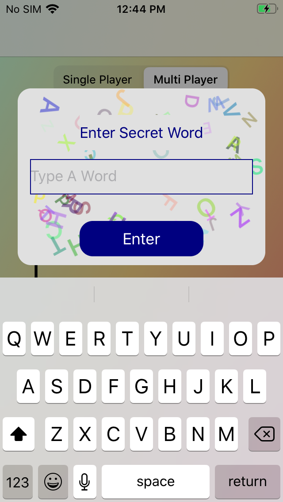
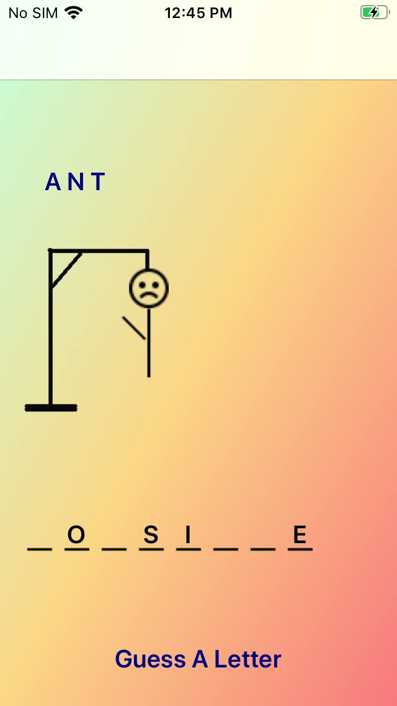
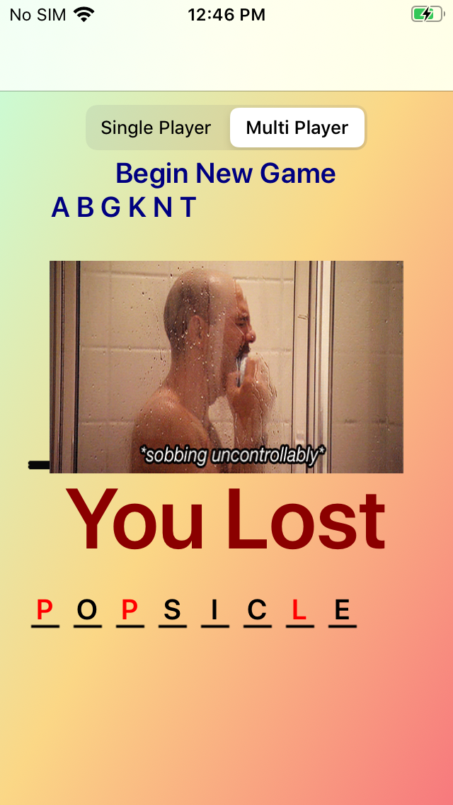

# Hangman
iOS app to play the game Hangman. Option to generate a random word or enter a word. User can enter letters to guess the word. 

## Screenshots
  

## Motivation
Wanted to make a fun game that could either be played alone or with others.

## Features
* Option to have a secret word auto-generated by selecting ‘Single Player’ or have a user enter a word by selecting ‘Multi Player’
* Dashes will appear on the screen for each letter in the secret word 
* The user can enter letters to guess what the word is. The game will keep track of all letters guessed and add to the hangman body when the guess is incorrect.
* If the letter guessed is not a valid character or has already been entered, an error will be shown and the user can guess again

## Challenges
* Had some difficulty positioning the dashes and letters on the screen as the letters had to be placed right on top of the dashes
* Had to figure out the exact positions for the body of the hangman

## Things I Learned
* Created a popup window to enter a word to begin the game and guess a letter. Popup window used delegation to pass data back to the main view. 
* Made the popup window contain letters of random colors to make the design look nice

## Future Improvements 
* Add an option to get more guess for longer words
